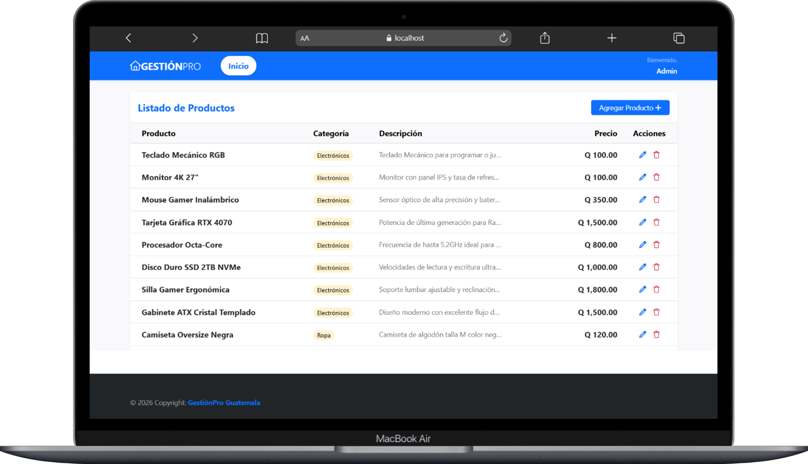
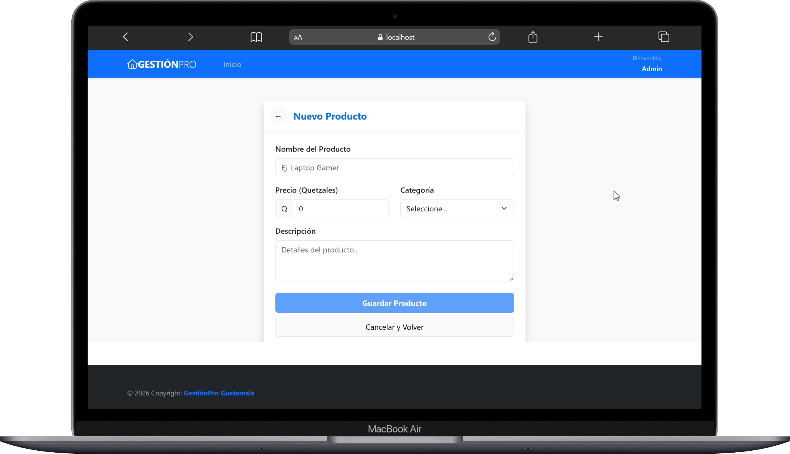
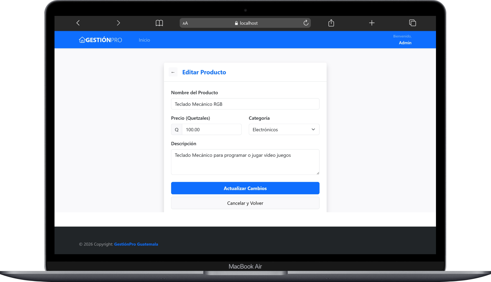
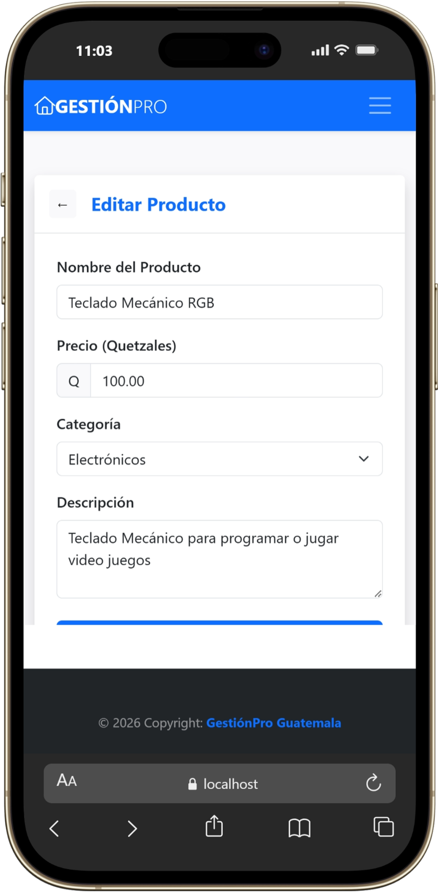

# CRUD Productos Fullstack

Aplicación web fullstack para la gestión de productos desarrollada con Angular, Node.js, Express, Sequelize y MySQL.

---

## Demo

Pendientes

---

## Tecnologías utilizadas

### Frontend
- Angular
- TypeScript
- Bootstrap

### Backend
- Node.js
- Express
- Sequelize
- MySQL

### Herramientas
- Git
- GitHub
- Netlify
- Render

---

## Funcionalidades

- Listar productos
- Crear productos
- Editar productos
- Eliminar productos
- Conexión frontend-backend mediante API REST
- Persistencia de datos en MySQL
- Variables de entorno con dotenv

---

## Estructura del proyecto

```txt
crud-productos-fullstack/
├── backend/
└── frontend/
```

---

## Instalación local

### Backend

```bash
cd backend
npm install
npm run dev
```

Crear archivo `.env`:

```env
DB_NAME=
DB_USER=
DB_PASSWORD=
DB_HOST=
DB_PORT=
```

---

### Frontend

```bash
cd frontend
npm install
ng serve
```

---

## Base de datos

El script SQL se encuentra en:

```txt
backend/database/productos.sql
```

---

## Capturas

### Listado de productos

<p align="center">
  
</p>

---

### Registro de productos

<p align="center">
  
</p>

---

### Edición de productos

<p align="center">
  
</p>

---

### Vista responsive

<p align="center">
  
</p>
---

## Autor

Rudy Isaías Morán Gómez